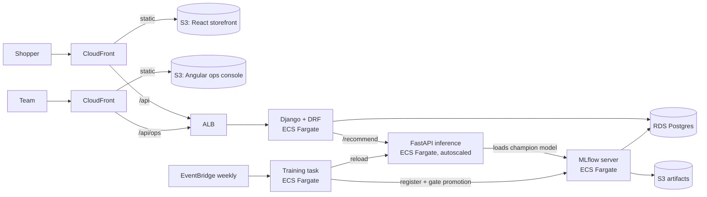

# Threadline

A production-style fashion recommender: a **two-stage model** (candidate retrieval + learning-to-rank)
trained on retail transactions, served by a **FastAPI** inference service, used through a **React**
storefront and a **Django** product API, managed from an **Angular** ops console, tracked and versioned
in **MLflow**, containerised with **Docker** and **deployed live on AWS EC2**. A full AWS production
setup (ECS Fargate, RDS, S3, CloudFront) is also written in **Terraform** with **GitHub Actions** CI/CD.

## Demo

https://github.com/user-attachments/assets/5f142a43-0427-4d47-bf66-0436de1cac39


## Screenshots

**Storefront: personalised home feed with 3D coverflow**


**Product page: "Complete the look" and "Similar items"**


**Bag**


**Ops console: model metrics, ablation, live latency**


---

## What it does

A shopper opens the storefront and sees three shelves: **Picked for you**, **Buy again** and
**Trending this week**. Each card says *why* it was recommended ("Often bought with items you chose",
"Matches your style"). Viewing a product updates the feed for the rest of the session. Product pages add
**Complete the look** (co-purchase) and **Similar items** (embedding similarity). Every impression, click
and add-to-bag is logged for evaluation and retraining.

The ops console shows the serving model's offline metrics against baselines, the ablation study, feature
importance, live latency percentiles, cache hit rate and click-through by placement, and lets the team
promote a registered model version, which the inference service hot-reloads.

## Deployment

### Live: one AWS EC2 server (what the demo runs on)

```
Browser ──► EC2 (Amazon Linux 2023, Docker Compose)
              ├─ storefront   React build served by nginx, proxies /api   :80
              ├─ ops          Angular build served by nginx                :8081
              ├─ app_api      Django + DRF (gunicorn)
              ├─ inference    FastAPI, loads the trained model bundle
              └─ postgres     shop data, events
```

The model is trained offline, and the trained bundle is copied to the server. Setup steps are in
[docs/EC2_DEPLOY.md](docs/EC2_DEPLOY.md).

### Designed for production: ECS Fargate (Terraform, validated, not applied)



The Terraform passes `terraform validate` in CI but has not been applied, because it costs more than a
single server. Guide: [docs/AWS_DEPLOY.md](docs/AWS_DEPLOY.md).

## The model

```
stage 1: retrieval (~100 candidates per user)          stage 2: ranking
  popularity by age band  ─┐                          38 features: user, item, user×item,
  repurchase history      ─┼─► union + source flags ─►   retrieval ranks and scores
  co-purchase neighbours  ─┤                          scikit-learn gradient boosting
  two-tower ANN (PyTorch) ─┘                          ─► top 12 + explanation
            ▲
  item content embeddings (TensorFlow autoencoder)
```

- **Two-tower retrieval (PyTorch)**: in-batch sampled softmax with logQ popularity correction and
  accidental-hit masking. Served from NumPy, so the inference image has no PyTorch; a test checks the
  NumPy and PyTorch forward passes agree.
- **Content embeddings (TensorFlow/Keras)**: denoising autoencoder over article attributes and a hashed
  bag of words from descriptions (plus EfficientNet image features when product photos exist).
- **Ranker (scikit-learn)**: `HistGradientBoostingClassifier` on engineered features. The same feature
  code runs offline and online, so training and serving cannot drift apart.
- **Evaluation**: strict time split, MAP@12 (the H&M competition metric), recall@12, candidate recall,
  catalogue coverage and AUC, against four single-retriever baselines.

Design choices and their trade-offs are written up in [docs/DESIGN.md](docs/DESIGN.md).

## Results

> **These numbers are from the bundled synthetic dataset** (2,500 articles, 30,000 customers, 16 weeks,
> 277k transactions) so the project runs without downloading anything. They show the pipeline works;
> they are not evidence of real-world quality. Train on the real H&M data before quoting results.

Held-out test week, 5,981 customers (model v2):

| Model | MAP@12 |
|---|---|
| Popularity by age band (baseline) | 0.0517 |
| Repurchase only | 0.0787 |
| Co-purchase only | 0.0673 |
| Two-tower only | 0.0867 |
| Ranker without deep-learning features | 0.1270 |
| **Full ranker** | **0.1280** (2.5× popularity) |

Candidate recall 52.4% · recall@12 27.6% · ranker AUC 0.816 · catalogue coverage 73.6%

**What the ablation says.** The two-tower model is the strongest single retriever and raises candidate
recall, but on synthetic data the deep-learning *ranker features* add almost nothing (0.1270 → 0.1280)
over the engineered ones. Repeat-purchase and recency features carry most of the signal. Whether that
holds on real data is an open question the H&M run answers.

**Serving latency** (FastAPI, 2 Uvicorn workers, 2 vCPUs, measured over HTTP, cache off):

| Load | p50 | p95 | p99 |
|---|---|---|---|
| One request at a time | 76 ms | 104 ms | 138 ms |
| 8 concurrent clients (≈20 req/s, CPU-bound) | 373 ms | 700 ms | — |

Throughput is CPU-bound in the pandas feature join. Mitigations in place: per-user response cache
(Redis or in-process), CPU-based autoscaling on ECS, and a popularity fallback if scoring fails.
Vectorising the online feature path in NumPy is the next optimisation.

## Tech stack

| Tool | Where it is used |
|---|---|
| Python, NumPy, pandas | Data pipeline, point-in-time features, metrics, online feature join |
| scikit-learn | Ranker, preprocessing, permutation importance |
| PyTorch | Two-tower retrieval model |
| TensorFlow / Keras | Item content embeddings (and optional image features) |
| FAISS | Nearest-neighbour search over item vectors |
| MLflow 3 | Experiment tracking, model registry, champion/challenger aliases |
| FastAPI | Inference service: `/recommend`, `/similar`, `/bought-together`, `/stats`, hot reload |
| Django + DRF | Catalogue, customers, feed, events, checkout, ops API, admin |
| PostgreSQL | Shop data and MLflow metadata |
| React + TypeScript + Vite | Customer storefront |
| Angular 18 | Internal ops console |
| Docker, Docker Compose | One image per service; full local stack; live EC2 deployment |
| AWS | **Live:** EC2. **In Terraform (validated, not applied):** ECS Fargate, RDS, S3, CloudFront, ECR, Cloud Map, EventBridge Scheduler, CloudWatch, SSM |
| Terraform | All ECS/RDS/CloudFront infrastructure (validated) |
| GitHub Actions | CI (tests, lint, builds, `terraform validate`); CD workflow for ECS written |

## Repository layout

```
ml/                     training + shared feature/serving code (package: threadline)
  threadline/           data, features, retrieval, two_tower, content, ranker, train, registry, bundle
  tests/                metrics, leakage, two-tower parity, recommender
services/inference/     FastAPI model service
services/app_api/       Django product API (app: shop)
web/storefront/         React storefront
web/ops-console/        Angular ops console
infra/mlflow/           MLflow server image
infra/terraform/        AWS infrastructure
scripts/                EC2 setup
.github/workflows/      CI and deploy
docs/                   design decisions, AWS and EC2 guides
```

## Run it locally

Requirements: Python 3.11 or 3.12, Node 22. About 10 minutes on a laptop CPU.

```bash
make setup            # Python packages (CPU PyTorch) and npm packages
make train            # synthetic data → train → evaluate → register in MLflow → promote
make seed             # create the shop database and load the catalogue

# each in its own terminal
make serve-inference  # :8001
make serve-api        # :8000
make web              # storefront on http://localhost:5173
make ops              # ops console on http://localhost:4200 (token: ops-dev-token)
```

MLflow UI: `mlflow ui --backend-store-uri sqlite:///mlflow.db`

### With Docker

```bash
make up    # Postgres, Redis, MLflow → one training run → inference, API, storefront, ops console
```

Storefront http://localhost:8080 · ops console http://localhost:8081 (token `local-ops-token`) ·
MLflow http://localhost:5000

## Using the real H&M data

1. Read the rules of the Kaggle competition *H&M Personalized Fashion Recommendations*. They decide
   what you may do with the data, including whether you may show product photos on a public site.
2. Put `articles.csv`, `customers.csv`, `transactions_train.csv` (and optionally `images/`) in
   `data/raw/hm/`.
3. `make train-hm`. The pipeline keeps the last 16 weeks (≈ 5M transactions) so it fits in 16 GB RAM.
   Train the two-tower model on a GPU (Colab/Kaggle) if CPU training is too slow.

## Tests

```bash
make test
```

33 tests: MAP@k against hand-computed cases, leakage checks on point-in-time features, NumPy/PyTorch
two-tower parity, candidate generation and cold start, every inference endpoint including the fallback
path and admin auth, and the Django feed, events, checkout and ops permissions.

## Known limitations

- No real users: no online A/B test. Ops-console engagement comes from demo traffic.
- The live EC2 demo is HTTP only, runs on one machine and has no MLflow server, so the ops console's
  Models page shows no registry there.
- The promotion gate compares models evaluated on different test weeks. It should re-score the
  champion on the challenger's test week.
- Pointwise ranker. LambdaRank (LightGBM) is the obvious next experiment.
- History updates online only through the session items sent with each request.

